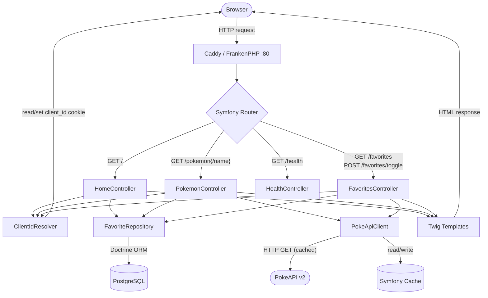
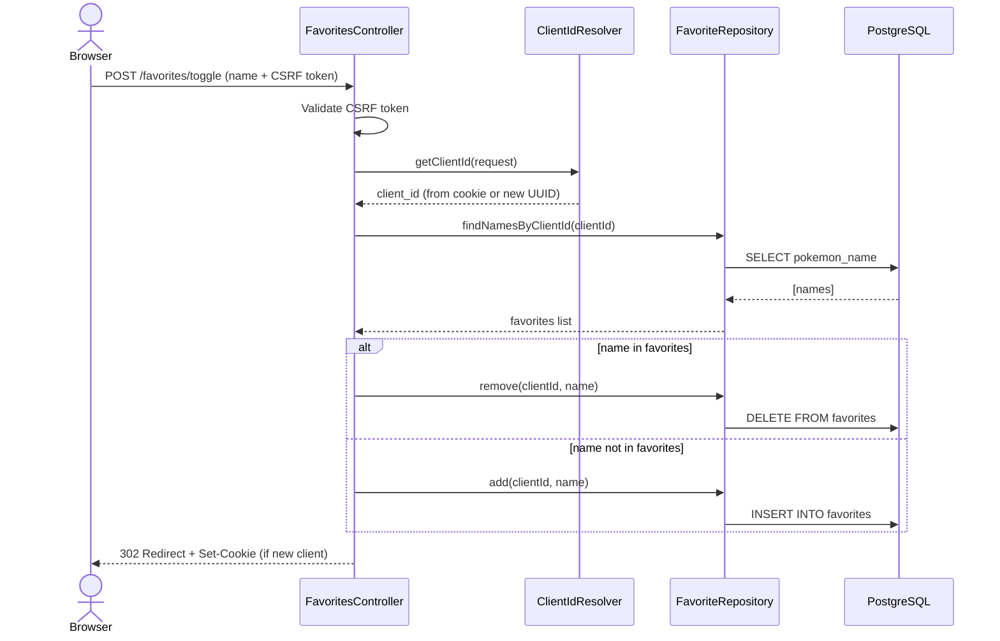

# Pokemon Finder - Symfony + PokeAPI

A Symfony web application for browsing, searching, and managing favorite Pokemon using the PokeAPI v2.

## Tech Stack

- **PHP 8.4** with FrankenPHP runtime
- **Symfony 8.0** (MVC architecture)
- **Twig** for server-side rendering
- **PostgreSQL 16** for persistent favorites storage
- **Doctrine ORM** for database access
- **Caddy** web server (via FrankenPHP)
- **Docker Compose** for containerization

## Prerequisites

- **Docker Desktop** for Windows installed and running
- **Git** for version control

## Quick Start

### 1. Clone the Repository
```powershell
git clone https://github.com/Viktors-Vinogradovs/pokeAPI-php-symfony.git 
cd pokeAPI-php-symfony
```

### 2. Start the Application
```powershell
docker compose up --build
```

Wait for the message: **"PHP app ready!"**

On first start, the container will:
1. Install Composer dependencies (including Doctrine ORM)
2. Wait for PostgreSQL to be ready
3. Automatically run database migrations

### 3. Access the Application

- **Home Page**: http://localhost:8000

To stop the application, press `Ctrl+C` in the terminal.

## Database

PostgreSQL 16 is included in the Docker Compose setup. Data is persisted in a named Docker volume (`database_data`).

### Run Migrations
```powershell
docker compose exec php bin/console doctrine:migrations:migrate --no-interaction
```

### Check Migration Status
```powershell
docker compose exec php bin/console doctrine:migrations:status
```

### Reset Database (removes all data)
```powershell
docker compose down -v
docker compose up --build
```

The `-v` flag removes all named volumes, including the PostgreSQL data volume. Migrations will re-run on next startup.

### Cache Management

```powershell
# Clear Symfony cache
docker compose exec php bin/console cache:clear

# Warm up cache
docker compose exec php bin/console cache:warmup
```

## Architecture

### Request Flow



### Favorite Toggle Sequence



## Favorites System

Favorites are persisted in PostgreSQL using an anonymous cookie-based system:
- On first visit, a `client_id` cookie (UUID v4) is set in the browser
- Favorites are stored per `client_id` in the `favorites` table
- Favorites survive browser restarts and server restarts
- CSRF protection on all toggle actions

## Troubleshooting

### Port 8000 Already in Use

Change the port in `.env`:
```
HTTP_PORT=8080
```
Then restart: `docker compose down && docker compose up -d`

### Database Connection Issues

```powershell
# Check if database is running
docker compose ps database

# View database logs
docker compose logs database

# Verify connection from PHP container
docker compose exec php bin/console dbal:run-sql "SELECT 1"
```

### Container Won't Start

```powershell
# Check Docker Desktop is running
docker ps

# View error logs
docker compose logs php

# Force rebuild
docker compose down
docker compose up --build --force-recreate
```

### Reset Everything (clean slate)

```powershell
docker compose down -v
docker compose up --build
```

## Environment Configuration

Edit `.env` file to configure:
- `HTTP_PORT` - Host port (default: 8000)
- `SERVER_NAME` - Server name (default: localhost)
- `APP_ENV` - Application environment (dev/prod)
- `APP_SECRET` - Application secret key
- `DATABASE_URL` - PostgreSQL connection string

## Available Routes

```powershell
docker compose exec php bin/console debug:router
```

Current routes:
- `GET /` - Home page
- `GET /pokemon` - Pokemon list with search and filtering
- `GET /pokemon/{name}` - Pokemon details page
- `GET /favorites` - Favorites page (carousel view)
- `POST /favorites/toggle` - Toggle favorite (CSRF protected)
- `GET /health` - Health check

---
